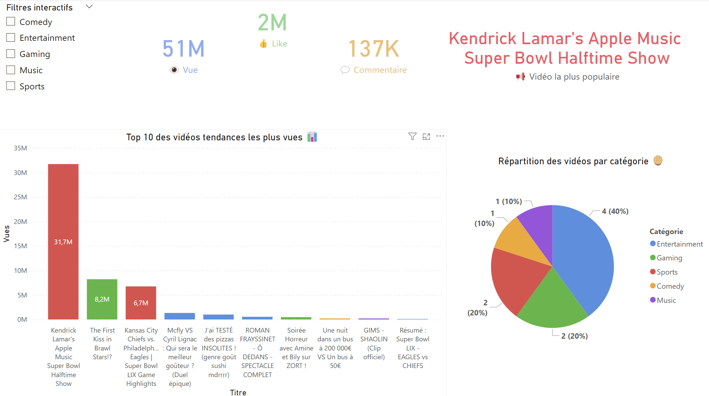
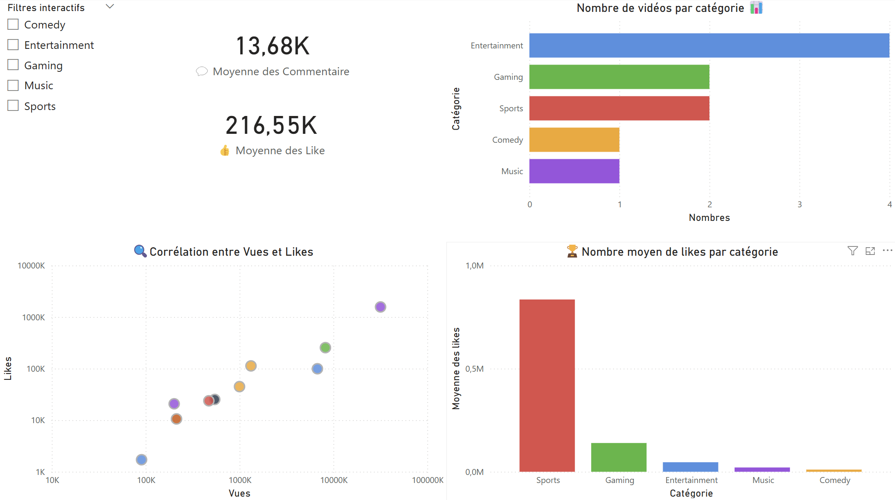

# 📊 **Mini-Projet YouTube Trends - 11 Février 2025**


📌 **Analyse des tendances YouTube réalisée le 11 février 2025.** Ce projet a pour objectif d’explorer et visualiser les vidéos les plus populaires sur YouTube, en utilisant **l’API YouTube Data v3**, **Python** et **Power BI**.

---

## 🎯 **Objectifs du Projet**
✅ Récupérer les vidéos tendances via l’API YouTube 📡  
✅ Analyser la répartition des catégories populaires 🎭  
✅ Étudier la corrélation entre les vues et les likes 🔍  
✅ Suivre l’évolution des tendances au fil du temps 📈  
✅ Construire un **dashboard interactif sous Power BI** 🚀  

---

## 📂 **Structure du Repository**

```
📂 youtube-trends-analysis
│── 📁 data                 # Données brutes et nettoyées
│    ├── youtube_trending_data.csv
│── 📁 notebooks            # Analyses exploratoires Jupyter
│    ├── requete.ipynb
│── 📁 scripts              # Scripts Python d’extraction et transformation
│    ├── code.py
│    ├── df.py
│    ├── requete.py
│── 📁 dashboards           # Fichiers Power BI
│    ├── MiniProjet_Youtube.pbix
│── 📁 images               # Captures d’écran du dashboard
│    ├── dashboard_page1.png
│    ├── dashboard_page2.png
│── README.md               # Présentation du projet
│── .gitignore              # Fichiers à ignorer
│── LICENSE                 # Licence du projet
```

---

## 📊 **Aperçu du Dashboard Power BI**

| **Vue d’ensemble des tendances** | **Analyse des catégories et créateurs** |
|----------------|----------------|
|  |  |


---

## 🛠 **Technologies Utilisées**
📌 **Extraction & Traitement des Données**  
- Python 🐍 (Requests, Pandas)  
- API YouTube Data v3  

📌 **Visualisation & Dashboard**  
- Power BI 📊  
- DAX pour les mesures avancées  

📌 **Stockage & Partage**  
- GitHub 📂  
- CSV pour le stockage des données  

---

## 🚀 **Comment Utiliser ce Projet ?**
### 📥 1. Cloner le repository  
```bash
git clone https://github.com/AtomCrtr/youtube-trends-analysis.git
cd youtube-trends-analysis
```

### ⚡ 2. Installer les dépendances  
```bash
pip install pandas requests
```

### 📡 3. Exécuter le script d’extraction des données  
```bash
python scripts/code.py
```

### 📊 4. Ouvrir le Dashboard Power BI  
Ouvre le fichier **`MiniProjet_Youtube.pbix`** pour visualiser l’analyse.  

---

## 📜 **Licence**
📌 Ce projet est sous licence **MIT**. Vous pouvez le modifier et le réutiliser librement.  

---

## 📩 **Contact & Contributions**
👨‍💻 **Développeur :** AtomCrtr  
📧 **Email :** ton_email@gmail.com  
💡 **Suggestions & Contributions :** Issues et Pull Requests sont bienvenues ! 🎉  

---

🔥 **Si ce projet t’a aidé, n’hésite pas à laisser une ⭐ sur GitHub !** 🚀
